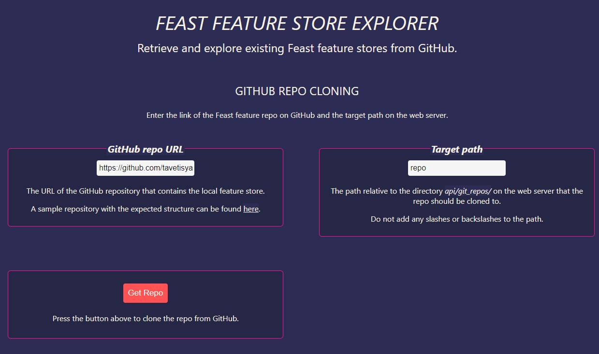
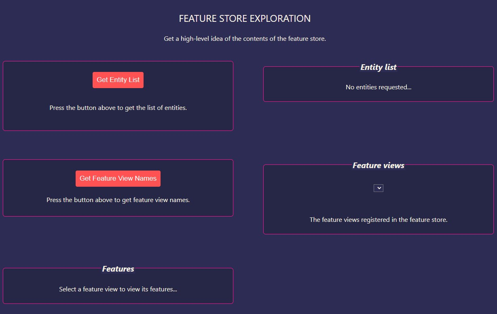
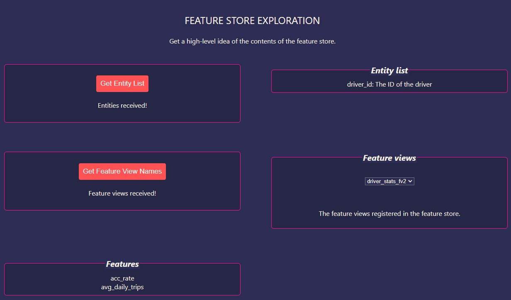
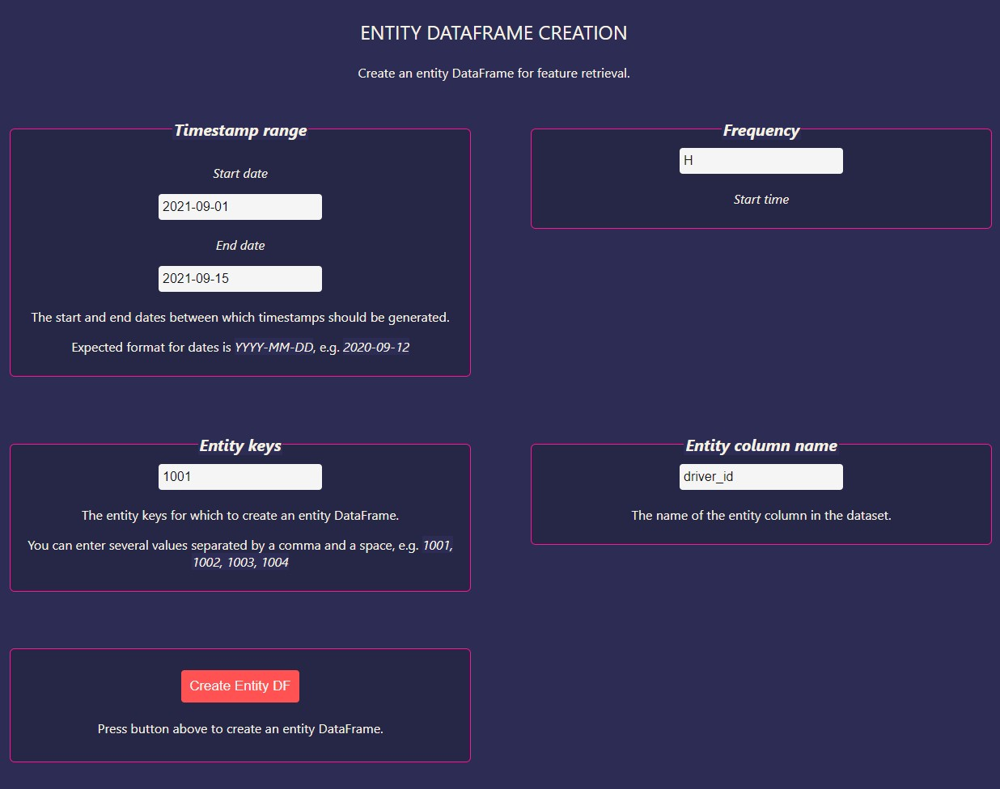
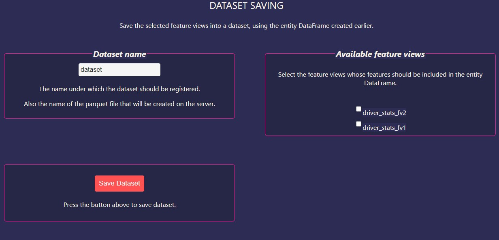
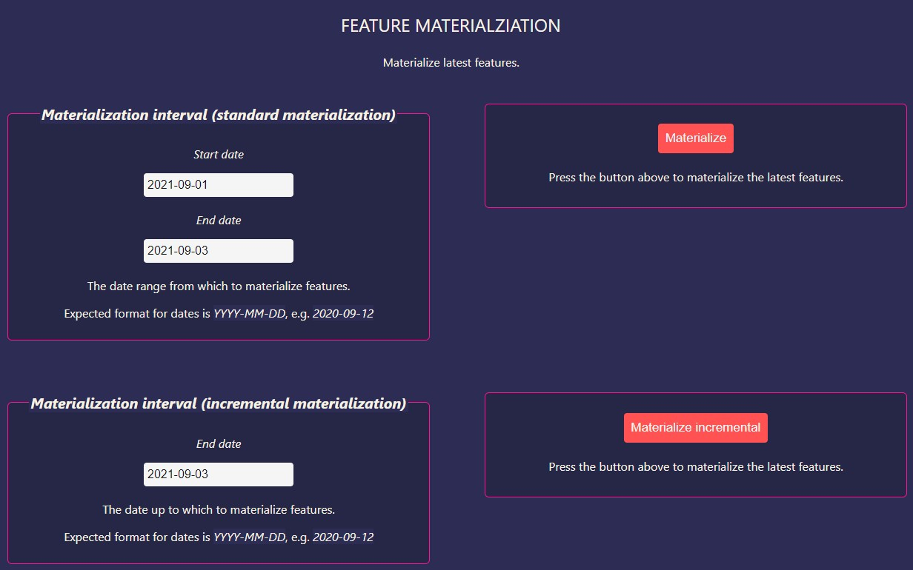

## Clone Project

Clone the project:

`git clone https://github.com/tavetisyan95/feast_web_app.git`


## Set the `api_url`

In the directory `app/feast_web_app/src/` inside `config.js`, edit the API URL, port, and endpoints, if necessary. The default config should work for most people.

```
export const config = {
  api_url: "localhost",
  api_port: 5000,  
  clone_repo_endpoint: "/clone_repo",
  get_store_endpoint: "/get_store",
  get_feature_views_endpoint: "/get_feature_views",
  get_feature_names_endpoint: "/get_feature_names",
  get_entities_endpoint: "/get_entities",
  register_entity_df_endpoint: "/register_entity_df",
  save_dataset_endpoint: "/save_dataset",
  materialize_endpoint: "/materialize",
  materialize_incremental_endpoint: "/materialize_incremental"
};

```

NOTE: don't put any http or slashes/backslashess in the api_url!


## Install Dependencies and Start Web Servers

To start the application's Docker container, launch Docker Desktop. Then, navigate to the root directory of the application, launch the terminal, and run the following command:

`docker-compose -f docker-compose.yaml up -d –build`

It may take some time for the app to spin up. Once you see terminal messages that the containers are up, navigate to `http://localhost:3000` in your web browser to open the application's webpage.

ALTERNATIVELY, you can run the `start.sh` shell script to start the web app without Docker. Run the command `bash start.sh` in the terminal to launch the shell script. If you are on Windows, you can use Git Bash to run shell scripts.


## 1. Cloning a Feast feature store GitHub repository

Once the app is running, the first thing to do is to clone a Feast feature store repo from GitHub. This is done in the section `GIT REPO CLONING`.



Use [this toy feature store repo](https://github.com/tavetisyan95/feast_web_app_toy_data) to test the app. By default, the link that appears in the box under `GitHub repo URL` leads to the toy feature store.

If you want to use a different repository, use its URL instead. But make sure that the structure mimics that of our toy feature store!

After the GitHub repo URL, you will also need to enter the target path for cloning under `Target path`. The app will clone the feature store repo to `api/git_repos/{target_path}` on the web server. **Don't add slashes** anywhere in `Target path`!

After you are done, press the button `Get Repo`. If everything is OK, you will see `Repo cloned!` under the button. Otherwise, you will see `Something went wrong. Check the API logs`.

Note that the app will save `Target path` for later use. When you save a dataset (more on this later), the app will use `Target path` to construct the desired path to the dataset.


## 2. Getting the feature store

Next, our Python API will need to load the cloned feature store. This is done in the section `FEATURE STORE RETRIEVAL`.


Under `Store path`, enter the directory where your feature store's `feature_store.yaml` config file is located. `Store path` should be relative to the root directory of the **ORIGINAL** repository. 

As an example, our toy feature store repo has the following sturcture:

```
feast_web_app_toy_data
├── driver_stats
│   ├── data
│   │   ├── driver_stats_1.parquet
│   │   ├── driver_stats_2.parquet
│   │   ├── online_store.db
│   │   └── registry.db
│   ├── definitions.py
│   └── feature_store.yaml
├── README.md
├── data_exploration.ipynb
├── data_preparation.ipynb
└── driver_stats_with_string.parquet
```

`feature_store.yaml` is located under `driver_stats/`. In this case, `driver_stats` (the default value) is what you should add - **no slashes** necessary.

On the web server, `Store path` is relative to `Target path` from the previous section - the API will append `Store path` to the path of the cloned repo.

After everything is ready, press `Get Store`. You will see `Store received!` under the button if everything went OK.

Note that the app will save `Store path` for later use, just like with `Target path`.


## 3. Exploring the feature store

Our app has some very light feature store exploration features. It allows you to check:

- Registered entities and their descriptions.
- Registered feature views.
- Registered features under each feature view.



To get the registered entity and feature view names, press the corresponding buttons.

With feature views, once you retrieve them, you will be able to select them under `Feature Views`. You will see the registered features for the selected feature view under `Features`.




## 4. Registering an entity DataFrame

Next, in the section `ENTITY DATAFRAME CREATION`, the app allows you to register an entity DataFrame, which you can later use to save data from some or all of the available feature views.



Here are the things that you can change when registering an entity DataFrame:

- `Timestamp range`. This field accepts two values - `Start date` and `End date`. The Python API will feed these values to the function `pandas.date_range` and generate timestamps between them. The default values correspond to the oldest and newest timestamps available in our toy feature repo.
- `Frequency`. This is the periodicity with which `pandas.date_range` will generate timestamps. The default value is `H` for hourly frequency, meaning that timestamps will be an hour apart. The app can accept [all other time offset aliases](https://pandas.pydata.org/docs/user_guide/timeseries.html#timeseries-offset-aliases) supported by `pandas.date_range`, but they might not work with some datasets!
- `Entity keys`. The entity keys that you want to create an entity DataFrame for. These are the IDs of the unique entities in your dataset. You can enter several entity keys, but make sure to separate them with a comma, like `1001, 1002, 1004`.
- `Entity column name`. This is the column in your data files that the unique IDs are located under. In our toy dataset, `Entity column name` is `driver_id`.

If you are using our toy dataset, you can leave the values unchanged and press `Create Entity DF`. If everything went OK, you will see `Entity DataFrame created!` under the button.

You can also check out the [repo of the toy dataset](https://github.com/tavetisyan95/feast_web_app_toy_data) to learn more about the entity keys and timestamps that will work with it.

## 5. Saving a dataset

In the section `DATASET SAVING`, you can select one or more available feature views, retrieve their historical feature values, and save them to a dataset.




Under `Dataset name`, enter the name under which you want to save the dataset. The dataset will be registered in your feature store under this name. Additionally, the name will be used as a filename for the parquet file that the dataset will be saved to.

Under `Available feature views`, you will see the feature views registered in your feature store. You can select one or more of them for saving.

After everything is ready, press `Save Dataset` to save your features in a dataset. 
You will see `Dataset saved!` if everything went OK.

When you save the dataset, the app uses `Target path`, `Store path`, and `Dataset name` to construct the directory for saving the dataset. The code for this looks like this:

```
# Storing the dataset locally on the server
app.store.create_saved_dataset(
    from_=job,
    name=dataset_info.dataset_name,
    storage=SavedDatasetFileStorage(
        f"api/git_repos/{app.target_path}/{app.repo_path}/data/{dataset_info.dataset_name}.parquet")
)
```

NOTE: `Available feature views` gets populated with feature view names after you press `Get Feature View Names` in the section `FEATURE STORE EXPLORATION`. If you retrieve feature view names and then refresh the webpage, you will need to get the feature view names again before saving the dataset.

## 6. Materializing features to the online store

Finally, you can materialize features in the section `FEATURE MATERIAlIZATION`.



To do standard (non-incremental) materialization, use the box `Materialization interval (standard materialization)`. In this box, you'll be able to select start and end dates for materialization.


For incremental materialization, use the box `Materialization interval (incremental materialization)`. You can select an end date for the materialization. Note that depending on the end date and the ttl of your feature views, incremental materialization may not be able to fetch any features.


## LIMITATIONS OF THE APP

In its current implementation, the app has some notable limitations, including:

- After you clone a repository, you cannot pull changes made after cloning. The only way to pull changes is to delete the repo on the web server and clone it from zero.
- The API expects timestamps in the format `%Y-%m-%d` (`YYYY-MM-DD`), e.g. `2021-09-01`. Other formats are not supported.
- Invalid inputs for parameters aren't handled. No error messages are shown in the web browser. The only way to know that something has gone wrong is through terminal logs. But there is one exception - if you don't select any feature views before saving a dataset, you will see `Please select at least one feature view` under the button `Save Dataset`.

## Starting in Docker
```docker-compose -f docker-compose.yaml up -d --build```